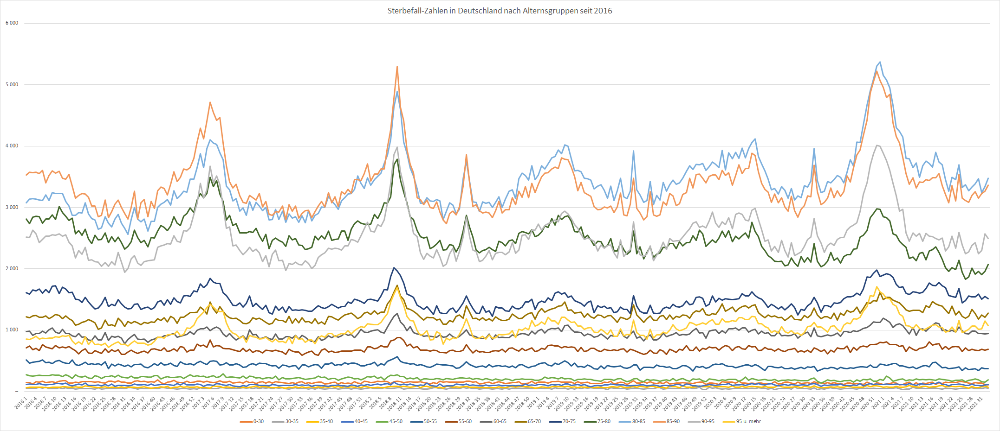

# Behauptung 1: Es gibt keine erhöhte Übersterblichkeit in Deutschland 2020
**Abschnitt im Video:** 13:23 - 25:00

**Unsere Beurteilung:** Falsch

**Quellen**:
 - https://www.destatis.de/DE/Themen/Gesellschaft-Umwelt/Bevoelkerung/Sterbefaelle-Lebenserwartung/Tabellen/sonderauswertung-sterbefaelle.html;jsessionid=C57A8AA251F2B455171363AB572FC354.live722?nn=209016

# Behauptung 2: Die Max-Plank-Institut Studie ist falsch, weil Äpfel mit Birnen verglichen werden / weil die Zahlen absolut und die Bezugsgrößen nicht angepasst wurden.
**Abschnitt im Video:** TODO

**Unsere Beurteilung:** TODO

TODO Zu prüfen Studie : Max Plank Institut Historisch hohe Übersterblichkeit

**Quellen**:
 - https://journals.plos.org/plosone/article?id=10.1371/journal.pone.0246663
 - https://www.demogr.mpg.de/de/news_events_6123/news_pressemitteilungen_4630/defo/uebersterblichkeit_in_europa_in_zusammenhang_mit_covid_19_8959
 - https://correctiv.org/faktencheck/2021/03/02/keine-uebersterblichkeit-2020-samuel-eckerts-berechnungen-sind-laut-statistischem-bundesamt-methodisch-unzulaessig/

# Behauptung 3: Die umfangreichen Maßnahmen sind nicht Grund dafür, dass die Übersterblichkeit gleich oder besser ist, denn in Schweden wo es nahezu keine Maßnahmen ist die Übersterblichkeit genauso wenig angestiegen.
**Abschnitt im Video:**  - 28:48

**Unsere Beurteilung:**

## Behauptung 3.1: Man kann Schweden für einen Vergleich mit Deutschland heranziehen
**Abschnitt im Video:**  - 28:48

**Unsere Beurteilung:**  Eher falsch

Meiner Meinung nach kann man Schweden und Deutschland nicht einfach vergleichen, ohne dass man sich vorher beide Länder konkret anguckt. Beide Länder sind in Sachen Bevölkerung, Größe aber auch in Bildung und Wohlstand durchaus sehr unterschiedlich gegenüber Deutschland.
Ein Vergleich mit beispielsweise anderen Skandinavischen Ländern wäre hier sicherlich sinnvoller gewesen.

In Schweden leben viel viel weniger Menschen auf insgesamt mehr Raum. Die medizinische Versorgung in Schweden ist in etwa vergleichbar mit der in Deutschland. Allerdings wurde Schweden als "eines der am besten vorbereiteten Länder auf den Umgang mit einer Pandemie eingeschätzt". Hätte es also sehr viele schwere Verläufe in Schweden gegeben, wäre das Gesundheitssystem sehr wsl. lange nicht so schnell zusammen gebrochen wie in Deutschland.

In Schweden leben derzeit ca. 10,6 Millionen Menschen, als ca. 12,8% der Bevölkerung in Deutschland (~83,1 Millionen) oder etwas weniger als im Bundesland Baden-Würtemberg (~11,1 Millionen) )
Das Land Schweden ist etwa 1,25 mal so groß wie Deutschland (Schweden 447435 Quadratkilometer vs. Deutschland 357581 Quadratkilometer)
So mit ergibt sich das in Schweden ca. 23 Einwohner pro km² leben, während in Deutschland ziemlich genau zehnmal so viele Menschen leben (233 Einwohner pro km²).  
Zwar ist Schweden insgesamt urbanisierter als Deutschland (es leben mehr Leute in Städten als auf dem Land). Allerdings sind die Städte in Schweden auch viel kleiner als in Deutschland. Zum Vergleich die größten 5 Städte in Schweden sind :
	 - Stockholm ~1,77 Millionen Einwohner
	 - Göteborg  ~0,66 Millionen Einwohner
	 - Malmö     ~0,32 Millionen Einwohner
	 - Uppsala   ~0,17 Millionen Einwohner
	 - Västeras  ~0,13 Millionen Einwohner

Die größten 5 Städte in Deutschland sind:
	 - Berlin    ~3,66 Millionen Einwohner
	 - Hamburg   ~1,85 Millionen Einwohner
	 - München   ~1,49 Millionen Einwohner
	 - Köln      ~1,08 Millionen Einwohner
	 - Frankfurt am Main ~0,76 Millionen Einwohner

Von den ersten 80 Großstädten in Deutschland unterschreitet keine die 0,1 Millionen Grenze.

**Quellen:**
 - https://de.statista.com/statistik/daten/studie/19316/umfrage/gesamtbevoelkerung-von-schweden/
 - https://de.wikipedia.org/wiki/Schweden
 - https://www.destatis.de/DE/Themen/Gesellschaft-Umwelt/Bevoelkerung/Bevoelkerungsstand/_inhalt.html
 - https://www.fr.de/politik/corona-schweden-sonderweg-gescheitert-coronavirus-herdenimmunitaet-sterblichkeit-pandemie-lockerungen-90934587.html#idAnchComments
 - https://www.ghsindex.org/
 - https://de.wikipedia.org/wiki/Global_Health_Security-Index
 - https://wise.com/de/blog/gesundheitssystem-schweden 	  
 - https://de.statista.com/statistik/daten/studie/284879/umfrage/groesste-staedte-in-schweden/
 - https://de.statista.com/statistik/daten/studie/1353/umfrage/einwohnerzahlen-der-grossstaedte-deutschlands/
 - https://de.statista.com/statistik/daten/studie/249029/umfrage/urbanisierung-in-den-eu-laendern/
 - https://www.google.com/url?sa=t&rct=j&q=&esrc=s&source=web&cd=&cad=rja&uact=8&ved=2ahUKEwj8q5Cc1YPzAhWd_rsIHUG7A0QQFnoECBMQAQ&url=https%3A%2F%2Fwww.regiodata.eu%2Fde%2Fnews%2F63-startseite%2Fnews%2F977-singlehaushalte-in-europa-die-schweden-wohnen-alleine&usg=AOvVaw2B-236yjW9SEOf2b2Be-ST

## Behauptung 3.2 Es gab in Schweden keine Corona-Schutz-Maßnahmen
**Abschnitt im Video:**  - 28:48

**Unsere Beurteilung:**  Nur teilweise richtig

Im März 2020 entschied sich Schweden dazu keine Lockdowns und keine Maskenpflicht zu verhängen. Außerdem blieben öffentliche Einrichtungen und Schulen weiterhin geöffnet. Das Ziel hierbei war, auf der einen Seite die eigene Wirtschaft zu schonen und die Freiheit der Menschen nicht zu weit einzuschränken und auf der anderen Seite, dass sich in der Bevölkerung hinreichend schnell eine Herden-Immunität einstellt. Mit anderen Worten könnte man auch sagen in Schweden hat man in Kauf genommen, dass evtl. mehr Menschen an Corona erkranken und evtl. sterben als in anderen Ländern.

Zur Zeit der ersten Welle gab es quasi keine Beschränkungen, sondern nur staatliche Empfehlungen wenn möglich im Home-Office zu arbeiten, Kontakte einzuschränken und Masken zu tragen. Wobei solche Regierungsempfehlungen in Schweden mehr Gewicht haben als in Deutschland. Es handelt sich hierbei nicht um freiwillig Handlungs-Empfehlungen. Zwar gibt es keine Busgelder bei Nicht-Einhaltung, es wird allerdings schon erwartet, dass man diesen Empfehlungen folge leistet.
Bereits zu dieser Zeit gab es allerdings auch in Schweden Corona-bedingte Einschränkungen. Veranstaltungen wurden beispielsweise auf eine maximale Anzahl von 50 Personen begrenzt. Es gab Besuchsverbote in Altersheimen. In der Bildung wechselten ältere Klassen und Universitäten in den Fern-Unterricht.

Zur zweite Wellen gab es dann auch in Schweden Kontaktbeschränkungen. Da die Inzidenzen weiter stark anstiegen waren maximal Treffen von 8 Personen (4 Personen in Restaurants) erlaubt. In der Gastronomie durfte ab 22:00 Uhr kein Alkohol mehr ausgeschenkt werden und kommunale öffentliche Einrichtungen wurden geschlossen. Viele private öffentliche Einrichtung wurden freiwillig geschlossen.

Das Ziel hiermit der Wirtschaft einen Vorteil gegenüber anderen Ländern zu verschaffen, wurden offenbar aber auch verfehlt:
"Schwedens Wirtschaft, die ja durch eine Strategie der lockeren Handhabe der Pandemie gestärkt werden sollte, schrumpfte von April bis Juni letzten Jahres weiter um 8,6% – was den größten vierteljährliche Rückgang im Land seit mindestens 40 Jahren bedeutet. Zum Vergleich: Die Wirtschaft Dänemarks schrumpfte in derselben Zeit um 7,4 %, die Norwegens um 5,1 % und die Finnlands nur um 3,2 %. Und auch die Arbeitslosenquote in Schweden stieg von 6,6% im März 2020 auf 9,5% im März 2021. Norwegen, Dänemark und Finnland verzeichneten alle einen geringeren Anstieg der Arbeitslosigkeit: im Durchschnitt um einen Prozentpunkt." Quelle : https://www.fr.de/politik/corona-schweden-sonderweg-gescheitert-coronavirus-herdenimmunitaet-sterblichkeit-pandemie-lockerungen-90934587.html#idAnchComments

**Quellen:**
 - https://www.fr.de/politik/corona-schweden-sonderweg-gescheitert-coronavirus-herdenimmunitaet-sterblichkeit-pandemie-lockerungen-90934587.html#idAnchComments
 - https://www.rnd.de/politik/schweden-beschliesst-corona-massnahmen-das-ende-des-sonderwegs-Y4DWEITCLRFPXLJMMDRPMBIMLI.html

## Behauptung 3.3: Es gab in Schweden auch keine höhere Sterblichkeit / Der schwedische Weg wäre erfolgreicher gewesen als in Deutschland
**Abschnitt im Video:**  - 28:48

**Unsere Beurteilung:** Eher falsch

Generell geht man in Schweden eher davon aus, dass der schwedische Schweg kein Erfolg war.
Die erste Welle verlief insgesamt eher schlechter als in den Nachbarländer oder zum Beispiel in Deutschland.
Die

“In der ersten Welle ist es den Schweden nicht gelungen, die vulnerablen Gruppen zu schützen”, fasst Andreas Radbruch im Frühjahr 2021 zusammen. “Vor allem mit Blick auf unsere Nachbarländer haben wir eine deutlich höhere Todesrate”, sagt Göran Hansson, Generalsekretär der Königlich-Schwedischen Akademie der Wissenschaften. “Und während der zweiten Welle zeigte sich, dass es noch keinen signifikanten Schutz durch eine natürlich erworbene Herdenimmunität gab.” Gezeigt habe sich laut Hansson, dass die Länder, die schnell reagiert haben – wie Norwegen und Finnland – bisher deutlich besser durch die Pandemie kommen. “Ein Fehler war, dass die Gesundheitsbehörden dachten, wir könnten eine Verbreitung des Virus in der Bevölkerung haben und gleichzeitig die alten Menschen schützen. Das hat nicht funktioniert.”

Laut der Studie "The lockdown effect: A counterfactual for Sweden" geht man davon aus, das Schweden 75% der Infektionen und 38% der Tode durch Corona hätte verhindern können, wenn sie im ersten Halbjahr 2020 einen mindestens 9 wöchigen Lockdown verhängt hätten.

Laut der Studie "Tracking excess mortality across countries during the COVID-19 pandemic with the World Mortality Dataset" gab es in Ländern mit hohen Kontaktbeschränkungen teilweise sogar eine reduzierte Sterblichkeit im Vergleich zu den Vorjahren, was der Studie darauf zurückzuführen sei, dass es durch den reduzierten Kontakt auch weniger Influenza / Grippe Tote gab. So wurde beispielsweise. Im Gegensatz dazu kann in Ländern in denen Corona sehr stark ausgebrochen ist eine Übersterblichkeit von mehr als 50% gemessen werden.

Laut der Studie "Estimating the effects of non-pharmaceutical interventions on COVID-19 in Europe" die den Effekt von Lockdowns auf die Veränderung der Infektions - und Sterberaten untersucht, kommt man zu dem Schluss dass in Deutschland ohne Kontaktbeschränkungen allein in der "ersten Welle" zu einer Wahrscheinlichkeit von 95% zwischen 370.000 und 770.000 mehr Menschen gestorben wären.

Die Übersterblichkeit in Schweden im Vergleich zu anderen Skandinavischen Ländern kann beispielsweise sehr gut in der Human Mortality Database untersucht werden. 

Zum Vergleich die gleiche Grafik für das sehr stark von Corona getroffene Land Chile.

Die Sterblichkeit in Deutschland wurde ja bereits zuvor bei Behauptung 1 analysiert um hier jedoch eine Vergleichbarkeit herzustellen sind im folgenden auch noch einmal die gleiche Grafiken für Deutschland dargestellt:

**Quelle:**  
 - https://journals.plos.org/plosone/article?id=10.1371/journal.pone.0249732
 - https://www.nature.com/articles/s41586-020-2405-7#Abs1
 - https://www.nature.com/articles/s41586-020-2405-7/tables/2
 - https://elifesciences.org/articles/69336
 - Human Mortality Database https://mpidr.shinyapps.io/stmortality/
 - https://www.aerzteblatt.de/nachrichten/119371/Schweden-meldet-hoechste-Zahl-an-Todesfaellen-seit-Spanischer-Grippe
 - https://www.deutschlandfunk.de/corona-pandemie-in-schweden-die-strategie-der-regierung-in.676.de.html?dram:article_id=497067
 - https://www.quarks.de/podcast/science-cops-mythos-schweden-alles-besser-im-corona-paradies/
 - https://ourworldindata.org/explorers/coronavirus-data-explorer?zoomToSelection=true&minPopulationFilter=1000000&time=2020-02-09..latest&facet=none&pickerSort=desc&pickerMetric=new_cases_smoothed_per_million&hideControls=true&Metric=Confirmed+deaths&Interval=Cumulative&Relative+to+Population=true&Align+outbreaks=false&country=DEU~FRA~SWE~DNK~NOR~NLD~ESP~ITA
 - https://www.rnd.de/gesundheit/schweden-kein-lockdown-keine-kontaktbeschrankungen-staatsvirologe-anders-tegnell-im-interview-BT2YYCQ3FBEUBHXRCLUQ2QXWUI.html

# Behauptung 4:
**Abschnitt im Video:** 29:00 - 53:35

**Unsere Beurteilung:** TODO

## Behauptung 4.1 Die Meldung der Intensivpatienten ist nicht plausibel, da es mehr intensiv-tote gibt als generell gemeldete tote in deutschland
**Abschnitt im Video:** 29:00 - 53:35

**Unsere Beurteilung:** TODO

## Behauptung 4.2 Die Wellen sind nicht in der Auslastung der Intensivbetten erkennbar
**Abschnitt im Video:** 29:00 - 53:35

**Unsere Beurteilung:** TODO

## Behauptung 4.3 Die Anzahl der Intensivbetten wird über die Zeit geringer -> Es werden Betten abgebaut
**Abschnitt im Video:** 29:00 - 53:35

**Unsere Beurteilung:** TODO

Glaubwürdigkeit des Videos bekommt ein 6. ExoMagazinTV -> Verschwörungstheorien, Ufos, Aliens, Mensch von Aliens geschaffen. angeblich in der Bibel beschrieben

 Der gute Herr Tom Lausen, wurde als Sachverständiger von der AFD beauftragt, nur mal so am Rande ;)

**Quellen:**
 - https://www.bundestag.de/resource/blob/850806/7bd14581e33890e68fe7d57ee67d4cbf/19_14-2_13-2-_ESV-Tom-Lausen-_Langfriste-Konsequenzen-data.pdf
 - https://www.rki.de/DE/Content/InfAZ/N/Neuartiges_Coronavirus/Intensivregister.html
 - Link zum Original-Video : https://www.bitchute.com/video/oqUtg6oPJBU/
 - Mehr Videos von ExoMagazinTV : https://www.bitchute.com/exomagazintv/
 - Amüsantes Video auf bitchute darüber, dass die Pyramiden von den Außerirdischen gebaut wurden und die Menschheit von den Aliens als ableger ihrer Gattung geschaffen wurden : https://www.bitchute.com/video/q5TWHC0dAc1B/

# Behauptung 5:
**Abschnitt im Video:** - 59:30

**Unsere Beurteilung:** TODO

## Behauptung 5.1 : PCR Tests sind nicht aussagekräftig, weil sie nur auf die Existenz eines Teils der RNA Prüfen und nicht aussagekräftig sind, ob eine lebensfähiges Virus vorhanden ist
**Abschnitt im Video:** - 59:30

**Unsere Beurteilung:** TODO

Grundsätzlich ist es möglich, dass ein Virus nachgewiesen wird, das sich noch nicht vermehrt hat. Aber: «Die Virusmengen sind dann so gering, dass das Resultat höchstens schwach positiv ausfällt», sagt Jürg Böni, Leiter der Abteilung Diagnostik und Entwicklung am Institut für Medizinische Virologie der Universität Zürich. Solche schwach positiven Resultate haben einen Anteil von rund 0,1 Prozent, schätzt Böni. Quelle : https://www.higgs.ch/wie-aussagekraeftig-sind-die-pcr-tests-fuer-sars-cov-2/36620/

**Quellen:**
https://www.higgs.ch/wie-aussagekraeftig-sind-die-pcr-tests-fuer-sars-cov-2/36620/

## Behauptung 5.2 : Es gibt schwere Fehler in dem Papier zu den PCR Tests von Drosten (cormandrostenreview.com)
**Abschnitt im Video:** - 59:30

**Unsere Beurteilung:** TODO

https://www.aerzteblatt.de/treffer?mode=s&wo=1041&typ=1&nid=118870&s=Lobeshymne&s=Verriss%2E%2E&s=dem&s=kurz&s=nach&s=wissenschaftlichen

Spannend finde ich den aktuellen Versuch einer Rufmordkampagne gegen Prof. Drosten:
https://cormandrostenreview.com
Was wirft man ihm dort vor? Er hat in Rekordzeit ein funktionsfähiges Protokoll zur Diagnostik von Sars-CoV-2 geliefert. Die wichtigste Pointe haben die Autoren dieser Rufmordkampagne allerdings übersehen. Das Protokoll von Drosten war nie als Dauerlösung gedacht, sondern als Brückentechnologie, um schnell mit hinreichender Genauigkeit das Virus nachweisen zu können. Das Protokoll musste spezifisch genug sein, bekannte Coronaviren beim Menschen und nah verwandte tierische Verwandte auszuschließen und gleichzeitig in der Lage sein bei noch unbekannten Sequenzvarianten dieses Erregers positive Ergebnisse zu liefern. Und dies unter extremem Zeitdruck, bei einer derartigen Epidemie zählt jeder Tag. In einer derartigen Situation sind die Anforderungen an das Primerdesign andere als für diagnostische Standard-PCR’s.

Form folgt Funktion, das sieht man beim Primerdesign für eine Brückentechnologie. Das sieht man aber auch in der Struktur dieser Rufmordkampagne. Wenn es um die Sache gehen würde, könnte man dies in vertraulichen Gesprächen klären. Hier ist die maximale Öffentlichkeit das Ziel, nicht die Klärung eines Sachverhalts. Ich schäme mich dafür, dass ehemalige Wissenschaftler sich für diese Rufmordkampagne hergeben. Wie bereits mein Vorredner sagte, Frau Prof. Kämmerer hat schon lange nichts mehr mit Virologie zu tun. Sie ist zwar lt. Google-Recherche an der Uni Würzburg gelistet, aber als apl. Prof. an der Frauenklinik und hat sich dort mit ketogener Ernährung und mit Krebs beschäftigt. Wenn man pubmed glauben darf, stammte die neueste virologische Publikation mit ihrem Namen von 1998. Das macht sie natürlich zur absoluten Expertin für Coronaviren:
https://pubmed.ncbi.nlm.nih.gov/9457433/

Weiteres Beispiel wie versucht wird gegen PCR Tests Stimmung zu machen sind solche Behauptungen:
https://correctiv.org/faktencheck/2021/08/27/nein-drostens-pcr-test-wird-nicht-die-zulassung-in-den-usa-entzogen/

Es ist wichtig zu verstehen, dass es keinen "Drosten Test" gibt. Das Forschungs-Team um Prof. Drosten hat eine Protokoll entwickelt (also quasi eine Art Anleitung oder Backrezept wie man mit dem Mittel des PCR Tests den Corona-Virus nachweisen kann.
https://www.charite.de/klinikum/themen_klinikum/themenschwerpunkt_coronavirus/faq_liste_zum_coronavirus/#c30695374

Diese Protokoll war nie als Dauerlösung gedacht, sondern als Brückentechnologie, um schnell mit hinreichender Genauigkeit das Virus nachweisen zu können. Das Protokoll musste spezifisch genug sein, bekannte Coronaviren beim Menschen und nah verwandte tierische Verwandte auszuschließen und gleichzeitig in der Lage sein bei noch unbekannten Sequenzvarianten dieses Erregers positive Ergebnisse zu liefern. Und dies unter extremem Zeitdruck, bei einer derartigen Epidemie zählt jeder Tag. In einer derartigen Situation sind die Anforderungen an das Primerdesign andere als für diagnostische Standard-PCR’s. Mittlerweile wurde es von vielen Herstellern weiterentwickelt.

Hier wird beschrieben wie sich die Verlässlichkeit der PCR Tests messen lässt: https://www.charite.de/klinikum/themen_klinikum/themenschwerpunkt_coronavirus/faq_liste_zum_coronavirus/#c30695381

**Quellen:**
 - Analyse des "Konsortiums" das das Paper von Drosten analysiert im Twitter-Format (leider ohne weitere Quellen zu nennen) https://twitter.com/Felicea/status/1333773413610086400

# Behauptung 6:
**Abschnitt im Video:** 1:00:00 - 1:00:02

**Unsere Beurteilung:** TODO

## 6.1 Inzidenz ist nicht aussagekräftig, da nur die positiven Tests gezählt werden, es wäre sinnvoller ein Verhältnis zwischen positiven und negativen Tests zu berechnen
**Abschnitt im Video:** 1:00:00 - 1:00:02

**Unsere Beurteilung :** Falsch
 Auch ein solcher Kennwert wird ebenso wie auch die 7-Tages Inzidenz jede Woche vom RKI berechet.
 Dieser Kennwert nennt sich "Positivenanteil in %" . Er wird berechnet in dem man das Verhältnis zwischen der "Anzahl Testungen" und "Anzahl positiv getestet" berechnet und dieses mit 100 multipliziert. Schaut man sich den Verlauf dieser Zahlen für den gesamten Zeitraum an, kann man hier wunderbar alle Anstiege unmittelbar zum Zeitpunkt der "Covide-Wellen" erkennen. Um das einmal besser für euch nachvollziehbar zu machen, habe ich das Ganze einmal selbst per Hand in Excel ausgewertet und das folgende Diagram erstellt :
 

**Quellen:**
 - https://www.rki.de/DE/Content/InfAZ/N/Neuartiges_Coronavirus/Testzahl.html

## Behauptung 6.2 Die positiven Test-Anzahlen sind nur gestiegen weil auch mehr getestet wurde
**Abschnitt im Video:** 1:00:00 - 1:00:02

**Unsere Beurteilung:** Falsch

Um mir ein besseres Bild darüber zu machen, ob die Behauptung, dass "Test-Anzahlen [] nur gestiegen [seien] weil auch mehr getestet wurde" habe ich mir die offiziellen Daten des RKI besorgt und alles einmal miteinander verglichen.

Zuerst wollte ich wissen ob es überhaupt so ist, dass die Test-Anzahlen überhaupt durchgehend steigen.
Hierbei fand ich zuallererst einmal heraus, dass zur Berechnung aller offizielen Zahlen lediglich PCR Tests berücksichtigt werden. Das bedeutet, dass Lageberichten und anderen Datenpublikationen wie z.B. Dashboard oder Inzidenzen lediglich mit PCR bestätigten COVID-19-Fälle zugrunde liegen. Die sogenannten Antigen "Schnelltests" werden bei der Berechnung dieser Zahlen nicht ausgewertet.
Die plötzliche Verfügbarkeit der "Schnelltests" die sich seit einigen Monaten überall im freien Verkauf befinden, ebenso wie die offiziellen Schnelltests die man beispielsweise in Apotheken machen kann zählen somit garnicht in die offiziellen Test-Ergebnisse. Das deutet schon mal darauf hin, dass die Test-Zahlen vlt. garnicht so stark gestiegen sind, wie man annehmen würde.

Guckt man auf die genauen Zahlen, stellt sich heraus, dass die Anzahl der PCR-Tests zwar insgesamt über den Verlauf der Pandemie gestiegen ist, allerdings steigt sie nicht kontinuierlich, sondern ist durchaus größeren Schwankungen ausgesetzt. Ich habe dazu mal anhand der Daten vom RKI ein Diagram erstellt.

Hier ist beispielsweise zu erkennen, dass die Testzahlen nach Ende der Feiertage im Dezember sehr stark gesunken sind. Im Frühjahr stiegen sie dann langsam wieder an um dann von Ende April bis Ende August fast durchgehend zu sinken.
Im Video bekommt man eher den Eindruck, die Testzahlen wären seit Beginn an immer nur gestiegen. Dies ist allerdings wie gerade gezeigt nicht so.

Im nächsten Schritt wollte ich wissen, ob die Anzahl der positiven Tests tatsächlich in einem ähnlichen Maße gestiegen ist, wie auch die Anzahl der durchgeführten Tests. Wäre dies der Fall (so wie im Video behauptet, müsste man hier zwei Kurven mit Ähnlichem Verlauf sehen können. Ich habe beide Zahlen-Reihen in dem folgenden Diagramm gegenübergestellt.

Auf den ersten Blick ist hier nur schwer zu erkennen, ob die beiden Kurven sich ähneln oder nicht.
Dies hat die Ursache, dass die Zahlen viel zu unterschiedlich groß sind. Während die Anzahl Testungen im Bereich 800.000 bis 1.600.000 pendelt, liegen die Anzahl positiver Testungen im Bereich 1.000 bis 200.000. Um solche Zahlen besser miteinander zu vergleichen habe ich sie mit der Z-Standardisierung normiert. Standardisierung / Normierung kommt allgemein immer dann zum Einsatz, wenn es darum geht Werte auf unterschiedlichen Skalen vergleichbar zu machen. Wendet man also die Z-Standardisierung auf eine beliebige Zahlenreihe an, egal in welchem Zahlenbereich sie sich befindet, bekommt man am Ende Zahlenreihen heraus die im gleichen Zahlenberich liegen und somit vergleichbar sind. Nach der Durchführung der Z-Standardisierung für die "Anzahl Testungen" und die "Anzahl positiv getestet" bekomme ich das unten gezeigte Bild. Hier sind nun beide Kurven miteinander vergleichbar.

Wäre die Behauptung im Video richtig, würden wir hier zwei relativ ähnliche Kurven sehen, immer wenn die "Anzahl der Testungen" steigt müsste folglich auch die "Anzahl positiv getestet" steigen. Das scheint allerdings nicht der Fall zu sein. Beide Kurven unterliegen voneinander unabhängigen Schwankungen. In der Kurve der positiven Tests ist jede "Corona-Welle" Deutschlands deutlich zu erkennen. Die erste "Welle" sehen wir im März/April 2020. Die Anzahl der Testungen ist hier relativ gleichmäßig, trotz allem steigt allerdings die Anzahl positiver Tests um ein vielfaches.
Im Sommer 2020 sehen wir dann sogar das genaue Gegenteil der Behauptung. Die Anzahl Testungen steigt angefangen im Juni kontinuierlich bis Ende Oktober. Die Anzahl positiver Tests jedoch bleibt bis Mitte September größtenteils konstant auf dem gleichen Level, es gibt nur einen sehr geringen Anstieg. Dann Ende September / Anfang Oktober sehen wir einen steilen Anstieg der positiven Tests, die sogenannte "2. Welle" beginnt. Die Zahlen steigen kontinuierlich bis in den Dezmber und erreichen um die Weihnachtszeit ihren Höhepunkt. Dann sinken sie langsam wieder ab um in der Mitte des Februars wieder auf ein "nomaleres Maß" zu sinken. Während dieser Zeit kann man weitere interessante Dinge sehen : Kurz vor der Weihnachtszeit werden deutlich mehr Tests durchgeführt. In der folge dessen steigen auch die Anzahl der positiven Tests. Nun könnte man meinen hier wäre der Beweis der Behauptung des Videos zu sehen. Doch schaut man sich nun einmal die Zeit direkt nach den Feiertagen an, kann man erkennen, dass die sehr viel weniger Tests durchgeführt werden, die Anzahl der positiven Tests allerdings nicht im gleichen Maße sinkt. Zwar sinkt sie, jedoch insgesamt viel weniger Stark als die Anzahl der Tests. Man könnte dies als ein Hinweis darauf deuten, dass sich während der Weihnachts-Feiertage viele Menschen angesteckt haben. Guckt man noch einmal zurück zum obigen Diagramm, dass den Positivenanteil in % darstellt, erkennt man genau das. Die höchsten Zahlen werden hier Ende Dezember, Anfang Januar dargestellt. Es gab also nicht nur mehr positive Tests, weil mehr getestet wurde, es haben sich zu dieser Zeit auch ein größer Anteil der getestetn Personen infiziert.
Ähnliche Dinge sehen wir im Verlauf von 2021. Im März 2020 ist der Beginn der "dritten Welle" zu erkennen. Es werden insgesamt mehr Tests durchgefüht und es gibt aus mehr positive Tests. Doch dann Ende März testen sich plötzlich weniger Menschen, trotz allem werden aber mehr Menschen positiv getestet. Gleiches sieht man in dem obigen Diagram des Positivenanteils in %, dieser steigt beinahe aufs selbe Maß wie zu den Weihnachts-Feiertagen. Was zu dieser Zeit passiert ist, kann man nur Mutmaßen. Eine Theorie könnte die Verfügbarkeit der Antigen-"Schnelltests" sein. Vermutlich haben viele Menschen nicht mehr auf die teuren und langsamen PCR Tests zurückgegriffen, sondern sich mit Antigen-Tests testen lassen. Da allerdings nur PCR Tests in den offizielen Statistiken berücksichtigt werden, sinkt die Anzahl der durchgeführten Tests. Da wir allerdings zu dieser Zeit bereits mitten in der "dritten Welle" sind, ist die Anzahl der positiven Tests weiterhin (auch bei weniger Tests) stark gestiegen.
Um das oben genannten noch weiter zu überprüfen habe ich zusätzlich aus den bestehenden Daten berechnet wie stark die Veränderung der einzelnen Zahlenreihen im Vergleich zur Vorwoche sind. Hiermit wollte ich überprüfen ob die Anzahl Testungen in die gleiche Richtung anwächst oder sich verringert wie die Anzahl positiver Tests. Wäre die Behauptung im Video korrekt müsste man in einem Diagramm erkennen können, dass sowohl die Anzahl Testungen als auch die Anzahl positiver Tests in ähnlichem Maße steigen oder fallen, mindestens Tendenzen sollten hierbei in die gleiche Richtung erkennbar sein.
Statistisch korrekt müsste man das ganze wieder in der Z-standardisiert darstellen, dar dieses Beispiel jedoch ohne konkrete Zahlen recht schwer nachzuvollziehen ist sind im folgenden eine Z-Standardisierte Darstellung und eine Darstellung mit zwei Skalen (links und rechts) dargestellt:

In beiden Darstellungen ist jedoch deutlich erkennbar dass die Veränderung der Anzahl positiv getesteter nicht allein mit der Veränderung der Anzahl durchgeführter Tests begründet werden kann.
Vor allem im Verlaufe des Jahres 2020 ist die gut erkennbar. Bis Ende März hinein sind die Veränderung beider Werte im positiven Bereich. Das bedeutet sowohl die Anzahl der Tests als auch die Anzahl positiv getester steigt kontinuierlich. Ab April bis Mitte Ende September ist dann jedoch die Veränderung der Anzahl positiv getesteter dauerhaft im negativen Bereich. Das bedeutet dass von Woche zu Woche weniger Leute positiv getestet werden. Zur gleichen Zeit ist allerdings eine andere Entwicklung in der Anzahl der Testungen zu sehen. Die Veränderung liegt mal im positven, mal im negativen, dann wieder im positiven und wieder im negativen Bereich. Die Anzahl der positiven Tests kann somit nicht ausschließlich geringer geworden sein, weil weniger getestet wurde. Eine Erklärung könnte hier wsl. eher sein, dass mit Ende März die schlimmste Phase der ersten Welle erreicht war und ab diesen Zeitpunkt die Infektionen geringer wurden. Wenn man sich einmal zurück erinnert gab es ab genau dieser Zeit in Deutschland erste Ausgangsbeschränkungen. Im späteren Verlauf (Mitte/Ende 2020-Herbst 2021) Jahres sieht man ein ähnliches Verhalten. Im Oktober sehen wir positive Wachstumsraten beider Zahlen. Anfang November gibt es in Deutschland dann den sogenannten "Lockdown-Light". Bis zu diesem Zeitpunkt stieg die Anzahl der positiven Tests immer weiter an, wenn auch immer langsamer. Genau ab Beginn des Lockdowns geht die Veränderung in den Negativen Bereich über, das bedeutet die Zahlen fallen wieder und das obwohl die Anzahl der durchgeführten Tests noch eine weitere Woche lang steigt (im positiven Bereich der Veränderung ist) und erst dann anfängt zu sinken (in den negativen Bereich der Veränderung eintritt). Um Weihnachten und Neujahr herum sieht man dann ein Muster-Beispiel dafür wie die gesamten Verläufe der Kurve aussehen müssten, wenn die Behauptung des Videos stimmen würde. Beide Kurven verändern sich hier exakt identisch. Allerdings auch wirklich nur hier. An anderen Stellen wie beispielsweise im Mai 2021 liegt die Veränderung der durchgeführten Tests im hohen positiven Bereich, während die Veränderung der positiv gestesten im negativen Bereich liegt. Das bedeutet konkret hier werden immer mehr Leute getestet, während immer weniger davon positiv sind.

**Quelle:**
 - https://www.rki.de/DE/Content/InfAZ/N/Neuartiges_Coronavirus/Testzahl.html
 - https://www.zdf.de/nachrichten/panorama/coronavirus-test-faelle-100.html
 - https://de.wikipedia.org/wiki/Inzidenz_%28Epidemiologie%29#7-Tage-Inzidenz
 - https://www.rki.de/SharedDocs/FAQ/NCOV2019/gesamt.html [Abschnitt : Werden die Meldedaten durch mehr Tests und die wachsende Anzahl an Schnelltests verzerrt?]
 - https://statistikgrundlagen.de/ebook/chapter/z-standardisierung/
 - https://de.wikipedia.org/wiki/Standardisierung_(Statistik)
 - https://de.wikipedia.org/wiki/COVID-19-Pandemie_in_Deutschland

# Behauptung 7:
**Abschnitt im Video:** TODO

**Unsere Beurteilung:** TODO
--> Man muss den Herstellern der Tests vertrauen, dass sie Tests entwickeln die Wirksam sind

Ringtests : https://www.higgs.ch/wie-aussagekraeftig-sind-die-pcr-tests-fuer-sars-cov-2/36620/
Regeln und Anforderungen an PCR Tests : z.B. vom RKI

# Behauptung 8:
**Abschnitt im Video:** 1:0:05 -> 1:09:

**Unsere Beurteilung:** TODO
 --> Es werden sehr viele Verdachtsfälle für Nebenwirkungen bei Impfungen gemeldet

unprofessionell vorher alles auf die Gold-Waage zu legen und dann anschließend Daten zu präsentieren die er noch nicht mal geprüft hat.

**Quellen:**
 - https://dpa-factchecking.com/germany/210614-99-988939/
 - https://correctiv.org/faktencheck/2021/04/16/meldungen-in-der-ema-datenbank-sind-keine-bestaetigten-nebenwirkungen-oder-todesfaelle-durch-covid-19-impfungen/
 - TODO Evtl. Wochebericht, der zeigen sollte dass 94 % der Corona-Fälle auf deutschen Intensivstationen sind Ungeimpfte.
 - https://www.pei.de/SharedDocs/Downloads/DE/newsroom/dossiers/sicherheitsberichte/sicherheitsbericht-27-12-bis-31-07-21.pdf?__blob=publicationFile&v=5#page13 Paul-Erlich-Institut : Verdachtsfälle von Nebenwirkungen und Impfkomplikationen nach Impfung zum Schutz vor COVID-19 seit Beginn der Impfkampagne am 27.12.2020 bis zum 31.07.2021

# Behauptung 9:
**Abschnitt im Video:** 1:09:

**Unsere Beurteilung:** TODO
 --> Die Wirksamkeit von Biontech Impfstoffen wird nicht korrekt gemessen, da nur die Infizierten-Anzahlen miteinander verglichen werden, aber nicht der Anteil der Gesamten Teilnehmer

Berechnung falsch! Man kann nicht einfach den einen Prozent Wert von dem anderen abziehen. Das ist mathematisch / statitisch nicht richtig.
Wenn er so rechnet, kann er nicht sagen, dass durch die Anzahl der Infektion durch die Impfung um 80 Prozent gesenkt wird. In wirklichkeit wird sie um 80 Prozentpunkte gesenkt. Das ist ein großer und wichtiger Unterschied. Möchte man wirklich Berechnen um wie viel Prozent die Anzahl der Infektionen sinkt muss man annehmen, dass in der Vergleichsgruppe genauso viele Infektionen stattfinden wie in der geimpften Gruppe. Die Anzahl dieser Infektionen muss man als 100 Prozen annehmen und dann berechnen wie viel Prozent davon in der geimpften Gruppe infiziert sind. Hierbei kommt man laut 100/0,838%*0,045 auf 5,36%. Das bedeutet, dass sich in der geimpften Gruppe 94,63% weniger Personen infizieren als in der nicht geimpften. Die Zahlen in der Studie sind somit korrekt.

Eigene Meinung : Anders als er sagt, ist es nicht relevant wie viele Personen sich nicht anstecken, weil das hängt nicht von dem Impfstoff sondern von den Randbedingungen wie Bevölkerungsdichte, Hygiene-Standards, Corona-Schutz-maßnahmen

Beispiel warum die Rechenweise unsinning leistet "Niemand würde anzweifeln, dass Sicherheitsgurte im Auto Tausende Leben retten. Schaut man sich aber eine gleich große Gruppe von Autofahrern mit und eine ohne Sicherheitsgurte über einen Zeitraum von 12 Wochen an, stellt man am Ende fest, dass in beiden Gruppen ziemlich viele Leute nicht an Autounfällen gestorben sind.

Die Zahlen dürften etwa gleich groß sein, in der Gruppe mit Gurt nur geringfügig höher. Diese Zahl zu vergleichen ist aber sinnlos. Wir wollen vergleichen, wie viele nun ohne Gurt GESTORBEN sind und wie viele Todesopfer das über einen längeren Zeitraum nun verringert, hier sind die Unterschiede ohne Zweifel immens groß." Quelle : https://www.volksverpetzer.de/corona-faktencheck/pandemie-in-den-rohdaten/

**Quellen:**
 - wie berechnet man die Impfstoffwirksamkeit : https://de.wikipedia.org/wiki/Impfstoffwirksamkeit
 - ImpfStoff-Protokoll : Biontech Pfizer https://pfe-pfizercom-d8-prod.s3.amazonaws.com/2020-09/C4591001_Clinical_Protocol.pdf

# Behauptung 10: Man müsse 125 Personen impfen um einen zu schützen.
**Abschnitt im Video:** - 1:12:

**Unsere Beurteilung:** TODO
Das ist mathematisch und logisch vollkommener Unsinn. Er nimmt an, dass sich von 125 Personen nur eine Person ansteckt. Somit seien 124 Personen unnötig den Nebenwirkungen der Impfstoffe ausgesetzt. 1. ist hierbei allerdings vollkommen unklar wer diese eine Person sein wird die sich ansteckt und 2. ist diese Zahl vollkommen abhängig davon wie die aktuelle Situation in dem Land ist. Wenn die Infektionen total durch die Decke gehen, sind deutlich weniger Personen "umsonst" den Nebenwirkungen ausgesetzt worden, wenn wiederum so gut wie keine Infektionen stattfinden sind deutlich mehr Personen "umsonst" den Nebenwirkungen ausgesetzt. Die Zahl die er hier annimmt ist eine Momentaufnahme zum Zeitpunkt der Studie.

# Behauptung 11 : Die einschlägigen Medien benutzen die selben Daten interpretieren sie nur anders
**Abschnitt im Video:** TODO

**Unsere Beurteilung:** TODO
Richtig : Allerdings vlt. interpretieren die die ja auch richtig und er nicht, schon mal drüber nachgedacht, wenn auf der Autobahn einem alle entgegefahren ob man vlt. in die falsche Richtung fährt?

# Behauptung 12: Er wird systematisch von der Politik getäuscht
**Abschnitt im Video:**  1:21:04

**Unsere Beurteilung:** TODO
