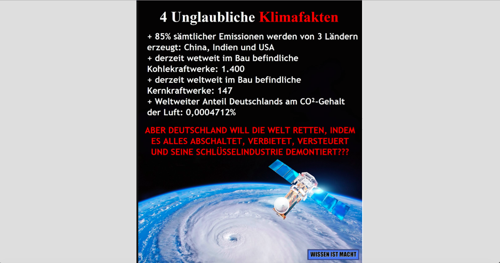

# Zu überprüfende Darstellung :

# Bewertung

Hallo *,

mich würde interessieren, ob du dir mal die Mühe gemacht hast das zu überprüfen, was du hier geteilt hast?

Ich finde es immer etwas schade, wenn sich irgendwelche dubiosen Daten ohne irgendwelche Quellenangaben im Internet verbreiten.

Vor allem da die Zahlen in deinem Bild auf den ersten Blick alles andere als plausibel sind. Da wäre es schon mal interessant wo diese Zahlen denn überhaupt herkommen?

Aber mal ein paar Fragen/Kommentare zu deinem Bild :

Zu 1. & 4. : China, USA und Indien stoßen am meisten Treibhausgase aus, das ist erst einmal richtig.
Alle Zahlen die ich finden kann ergeben für alle drei Länder zusammen jedoch immer unter 85% . [1] [2] [3]

Der CO2 Ausstoß Deutschlands hat im Jahr 2018 2% des weltweiten CO2 Ausstoßs ausgemacht. In Europa liegt Deutschland somit eindeutig auf Platz 1. Weltweit immerhin noch in den Top 10. [1] [2] [3]

Und das obwohl Deutschland im Vergleich zu den anderen Staaten ein extrem kleines Land ist. Rechnet man das Ganze dann auf den CO2 Ausstoß pro Kopf herunter liegt Deutschland sogar vor Indien, China. [4]

Die Angabe aus dem Bild "Weltweiter Anteil Deutschlands am CO2-Gehalt der Luft" scheint mir außerdem gezielt unpräzise vormuliert zu sein.

Es ist dabei nicht klar, wie man rechnerisch auf diesen Wert kommen soll. Hast du eine Idee oder hast du es einfach nur kopiert?

Ich komme zu dem Schluss, dass das kleine reiche Land Deutschland sehr wohl einen großen Einfluss auf den weltweiten Ausstoß von Treibhausgasen hat.

Zu welchem Ergebnis kommst du? Das Bild versucht meiner Meinung nach jedoch genau das Gegenteil zu vermitteln.

Deutschland liegt laut dem HDI (Human Development Index), mit dem man allgemein hin den Wohlstand / Lebensstandard der Einwohner eines Landes misst, auf Platz 4 weltweit. [5] [6] [7]

Wir sind ein reiches Land, eines der wenigen Länder die es sich wirklich finanziell leisten kann, dem Klima-Wandel entgegen zu wirken.
Wenn wir als reiches Land nicht mit gutem Vorbild voran gehen, wird es niemand tun.

Kommen wir zum nächsten Thema : Ist dir bewusst was der Menschheit bevor steht, wenn die Berechnungen der führenden Wissenschaftler zutreffen?

Das Wetter wird sich zukünftig stark verändern. Es wird deutlich mehr extreme Wetterereignisse geben : Waldbrände, heftige Stürme, Dürren und extreme Niederschläge/Überflutungen, Hitzewellen und extreme Kälteperioden. [8] [9]

Wenn wir die Erwärmung dieses Planeten nicht in den Griff bekommen, dann dann werden die Permafrost-Böden auftauen.

"In Permafrostgebieten der Arktis, Antarktis und den Hochgebirgen sind zwischen 13.000 und 15.000 Gigatonnen Kohlenstoff gespeichert. Das ist etwa doppelt so viel wie in der gesamten Erdatmosphäre. Beim durch den Klimawandel beschleunigten Auftauen der Permafrostböden wird dieser als Treibhausgas CO2 freigesetzt." [10]

Das wird das Ganze noch unfassbar beschleunigen. Manche Orte werden unter diesen Wetterereignissen mehr leiden als andere. Und die, die es schlechter trifft als andere, weil ihre Heimat zerstört oder nicht mehr bewohnbar ist, weil es nicht genügend Wasser gibt oder weil die Böden keine Landwirtschaft mehr möglich machen, diese Menschen werden sich auf die Reise machen und ein neues Zuhause suchen. Wenn ich deine Posts bei FB so verfolge, scheinst du nicht unbedingt ein Freund von unkontrollierter Migration zu sein.

Falls ich damit richtig liege, frage ich mich, ob dir das Wort "Klima-Flucht"/"Umwelt-Flucht" ein Begriff ist. Falls nicht, solltest du dich vlt. einmal damit beschäftigen, denn die Menge an Geflüchteten die Europa momentan zu bewältigen hat, wird wahrscheinlich nicht vergleichbar sein mit den Massen die in Zukunft unterwegs sind.

**Quellen :**

[1] : https://op.europa.eu/en/publication-detail/-/publication/9d09ccd1-e0dd-11e9-9c4e-01aa75ed71a1/language-en

[2] : https://de.wikipedia.org/wiki/Liste_der_L%C3%A4nder_nach_Treibhausgas-Emissionen / https://www.climatewatchdata.org/ghg-emissions?source=51

[3] : https://de.statista.com/statistik/daten/studie/179260/umfrage/die-zehn-groessten-c02-emittenten-weltweit/

[4] : https://de.wikipedia.org/wiki/Liste_der_L%C3%A4nder_nach_CO2-Emission_pro_Kopf

[5] : https://www.laenderdaten.de/indizes/hdi.aspx

[6] : https://geoplay.de/rankings/hdi.aspx

[7] : http://www.bpb.de/internationales/weltweit/megastaedte/64733/hdi

[8] : https://www.umweltbundesamt.de/themen/klima-energie/klimafolgen-anpassung/folgen-des-klimawandels-0#textpart-6

[9] : https://de.wikipedia.org/wiki/Folgen_der_globalen_Erw%C3%A4rmung

[10] : https://de.wikipedia.org/wiki/Folgen_der_globalen_Erw%C3%A4rmung#Permafrostb%C3%B6den
